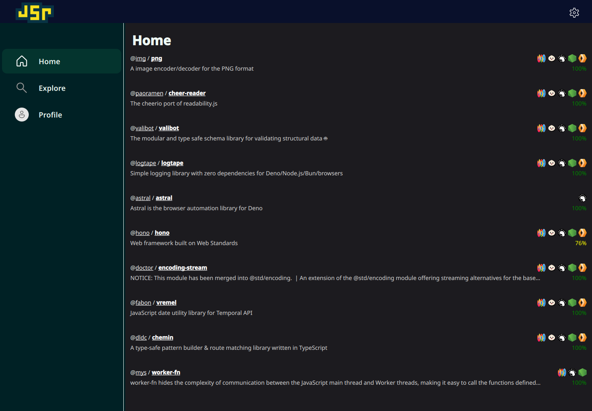
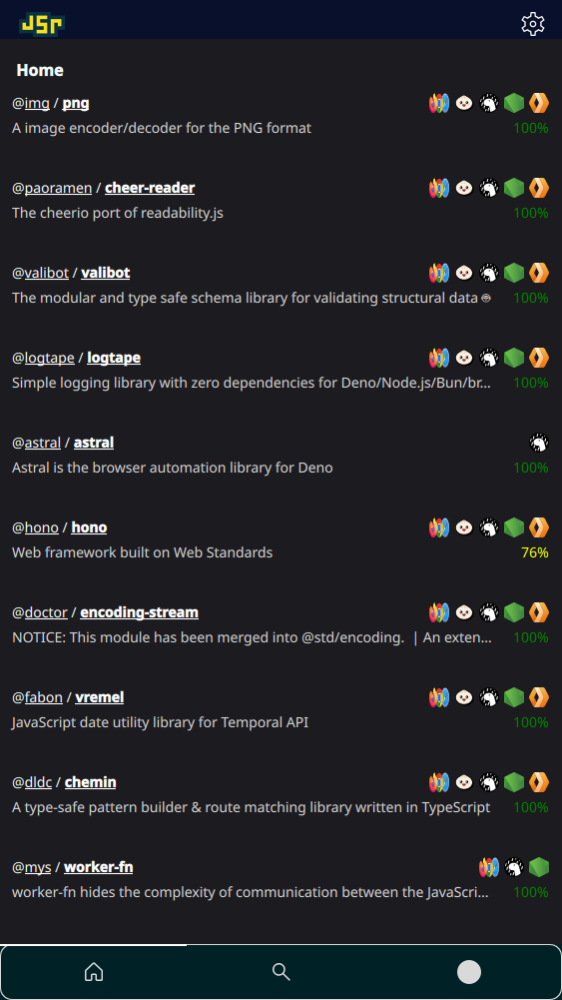

# JSR

POC JSR client written in C++ using Qt6. Inspired by [littledivy's iOS beta](https://github.com/littledivy/jsr_ios). Some icons from official JSR repository.




**THIS IS UNFINISHED!!!**

Made mostly to compare Swift and SwiftUI against Qt6 and QML. While QML might require a few more lines of code, it offers support for all platforms and screen-sizes and hardware-accelerated logic in exchange. It's also much more reactive and declarative.

I considered writting a command-line program to automatically generate OpenAPI bindings for compile-time the way Swift does, but I eventually decided it was too much effort. I may return to this some day. For now, I think this works just as well:

```qml
HTTPClient {
    id: client
    base: "https://api.jsr.io"

    Endpoint {
        id: listPackages
        path: "/packages"
        method: "GET"
    }

    Endpoint {
        id: getStats
        path: "/stats"
        method: "GET"
    }
}
```

## Building

Requires CMake, Ninja, Qt 6.8 or later, and a decent C++ compiler.

    cmake -S . -B build -G Ninja
    cmake --build build
    ./build/jsr

